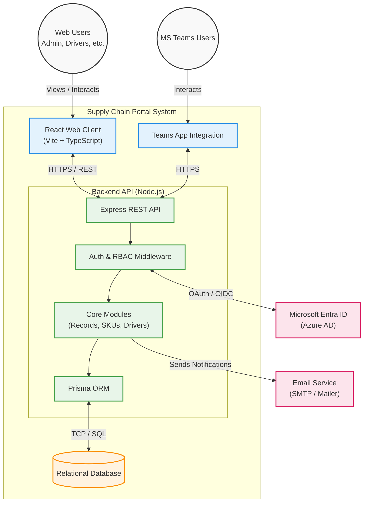

# High-Level System Architecture

This section details the primary components of the Supply Chain Portal and how data flows between them.

```mermaid
flowchart TD
    %% Define styles
    classDef actor fill:#f9f9f9,stroke:#333,stroke-width:2px;
    classDef frontend fill:#E3F2FD,stroke:#1E88E5,stroke-width:2px;
    classDef backend fill:#E8F5E9,stroke:#43A047,stroke-width:2px;
    classDef database fill:#FFF3E0,stroke:#FB8C00,stroke-width:2px;
    classDef external fill:#FCE4EC,stroke:#D81B60,stroke-width:2px;

    %% Actors
    User((Web Users\nAdmin, Drivers, etc.)):::actor
    TeamsUser((MS Teams Users)):::actor

    %% System Components
    subgraph System["Supply Chain Portal System"]
        direction TB
        
        %% Client Layer
        SPA["React Web Client\n(Vite + TypeScript)"]:::frontend
        TeamsApp["Teams App Integration"]:::frontend

        %% API Layer
        subgraph API["Backend API (Node.js)"]
            Router["Express REST API"]:::backend
            AuthService["Auth & RBAC Middleware"]:::backend
            BusinessLogic["Core Modules\n(Records, SKUs, Drivers)"]:::backend
            Prisma["Prisma ORM"]:::backend
        end

        %% Data Layer
        DB[("Relational Database")]:::database
    end

    %% External Systems
    ExternalAuth["Microsoft Entra ID\n(Azure AD)"]:::external
    EmailService["Email Service\n(SMTP / Mailer)"]:::external

    %% Connections
    User -->|Views / Interacts| SPA
    TeamsUser -->|Interacts| TeamsApp
    
    SPA <-->|HTTPS / REST| Router
    TeamsApp <-->|HTTPS| Router
    
    Router --> AuthService
    AuthService --> BusinessLogic
    BusinessLogic --> Prisma
    Prisma <-->|TCP / SQL| DB
    
    AuthService <-->|OAuth / OIDC| ExternalAuth
    BusinessLogic -->|Sends Notifications| EmailService
```
